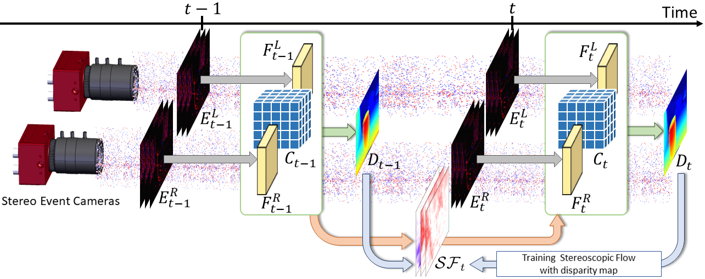

# Temporal Event Stereo via Joint Learning with Stereoscopic Flow (TESNet) (ECCV2024)
<p align="center">
 
</p>


Official code for "Temporal Event Stereo via Joint Learning with Stereoscopic Flow" (ECCV2024)
([Paper](https://arxiv.org/abs/2407.10831))


```bibtex
@Article{tes24eccv,
  author  = {Hoonhee Cho* and Jae-Young Kang* and Kuk-Jin Yoon},
  title   = {Temporal Event Stereo via Joint Learning with Stereoscopic Flow},
  journal = {European Conference on Computer Vision. (ECCV)},
  year    = {2024},
}
```


## Abstract
Event cameras are dynamic vision sensors inspired by the biological retina, characterized by their high dynamic range, high temporal resolution, and low power consumption. These features make them capable of perceiving 3D environments even in extreme conditions. Event data is continuous across the time dimension, which allows a detailed description of each pixel's movements. To fully utilize the temporally dense and continuous nature of event cameras, we propose a novel temporal event stereo, a framework that continuously uses information from previous time steps. This is accomplished through the simultaneous training of an event stereo matching network alongside stereoscopic flow, a new concept that captures all pixel movements from stereo cameras. Since obtaining ground truth for optical flow during training is challenging, we propose a method that uses only disparity maps to train the stereoscopic flow. The performance of event-based stereo matching is enhanced by temporally aggregating information using the flows. We have achieved state-of-the-art performance on the MVSEC and the DSEC datasets. The method is computationally efficient, as it stacks previous information in a cascading manner. 


## Datasets
We utilize the pseudo dense label for stable training of temporal stereo. To make the pseudo label, we first train the single event stereo, which has the same backbone of temporal event stereo (TESNet), but does not use the temporal aggregation.

### MVSEC
Please do not forget to cite [MVSEC](https://daniilidis-group.github.io/mvsec/) if you are using the MVSEC dataset.
We provide the pre-processed MVSEC dataset following [Link](https://drive.google.com/drive/folders/1ANrz99Z3UwAcTMBlQyz_PYnoRblySh8H?usp=sharing).

```
The MVSEC dataset should have the following format:
    ├── MVSEC_dataset                 
    │   ├── indoor_flying_1          
    │   │   ├── event0
    │   │   ├── event1
    │   │   ├── pseudo_disp
    │   │   ├── disparity_image
    │   │   ├── voxel0skip1bin5
    │   │   ├── voxel1skip1bin5
    │   └── indoor_flying_2
    │       ├── event0
    │       └── ... 
```

### DSEC
The DSEC dataset can be downloaded [here](https://dsec.ifi.uzh.ch/dsec-datasets/download/). Please do not forget to cite [DSEC](https://github.com/uzh-rpg/DSEC) if you are using the DSEC dataset.
The pseudo label generated by our works can be downloaded [Link](https://drive.google.com/drive/folders/1Hcoarpo40lVnlXQx4CERtW5loyfv6zNf?usp=sharing).

```
The DSEC dataset should have the following format:
    ├── DSEC
    │   ├── train               
    │   │   ├── zurich_city_00_a
    │   │   │   │   ├── events
    │   │   │   │   │     ├── left
    │   │   │   │   │     └── right
    │   │   │   │   ├── images
    │   │   │   │   │     ├── left
    │   │   │   │   │     ├── right
    │   │   │   │   │     └── timestamps.txt
    │   │   │   │   ├── raw_events
    │   │   │   │   │     ├── left
    │   │   │   │   │     └── right
    │   │   │   │   ├── disparity
    │   │   │   │   │     ├── event
    │   │   │   │   │     └── timestamps.txt   
    │   │   │   │   └── voxel_50ms_15bin
    │   │   │   │         ├── left
    │   │   │   │         └── right
    │   │   └── ...
    │   └── test
    │       ├── zurich_city_12_a
    │   │   │   │   ├── events
    │   │   │   │   │     ├── left
    │   │   │   │   │     └── right
    │   │   │   │   ├── images
    │   │   │   │   │     ├── left
    │   │   │   │   │     ├── right
    │   │   │   │   │     └── timestamps.txt
    │   │   │   │   └── voxel_50ms_15bin
    │   │   │   │         ├── left
    │   │   │   │         └── right
    │       └── ...
    └──  DSEC_pseudo_GT_all
       └── train
             ├── zurich_city_00_a
             │    ├── 000001.png
             │    └── ...
             ├── zurich_city_00_b
             └── ...
```

We also pre-generate the voxel grid and raw events to prevent the repetitive calculation in dataloader.
This can be done using the provided code in the processing directory with the following command:

```bash
python processing/voxel_generate.py --dataset_path $DSEC_DATASET_PATH$
python processing/voxel_generate_night.py --dataset_path $DSEC_NIGHT_DATASET_PATH$
```
